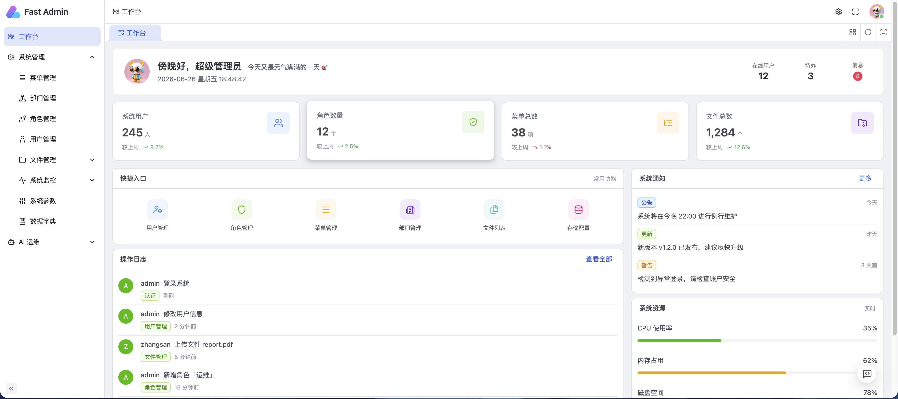
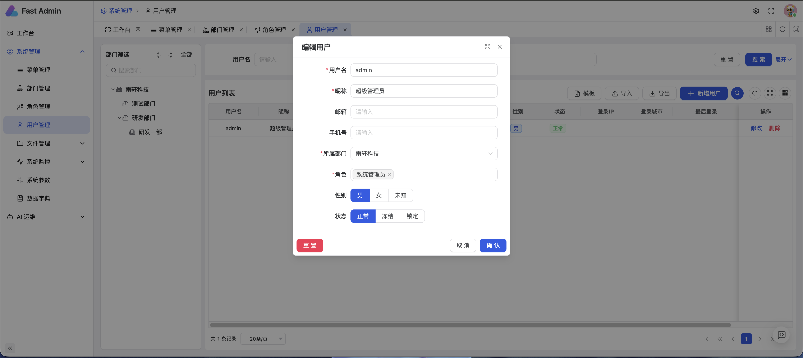
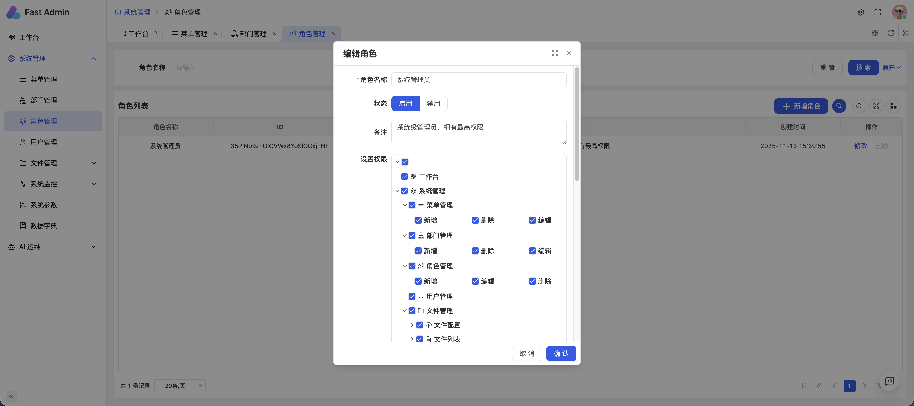
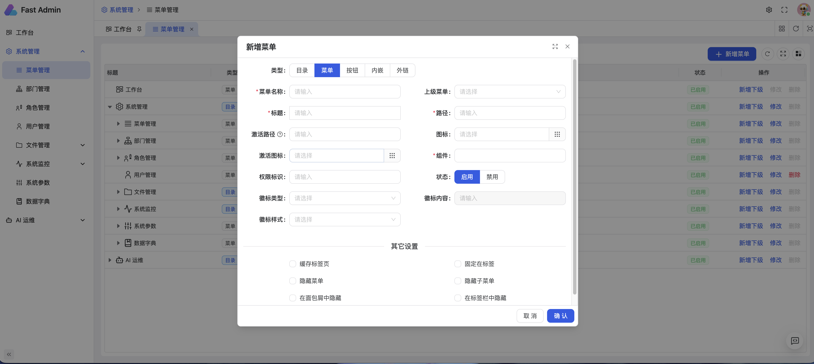
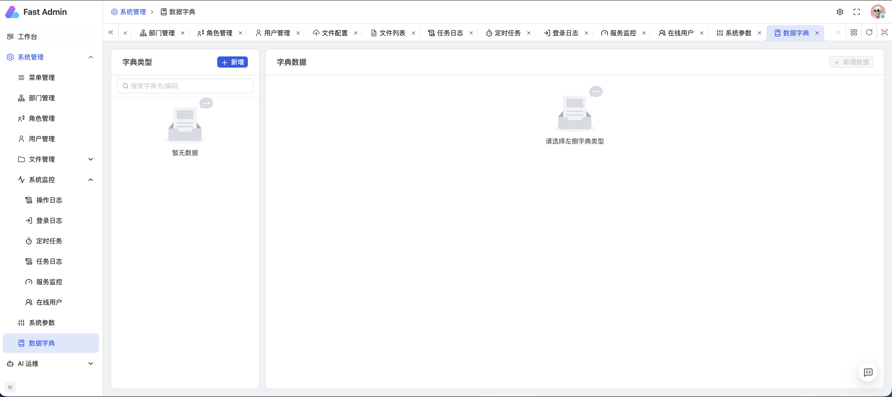
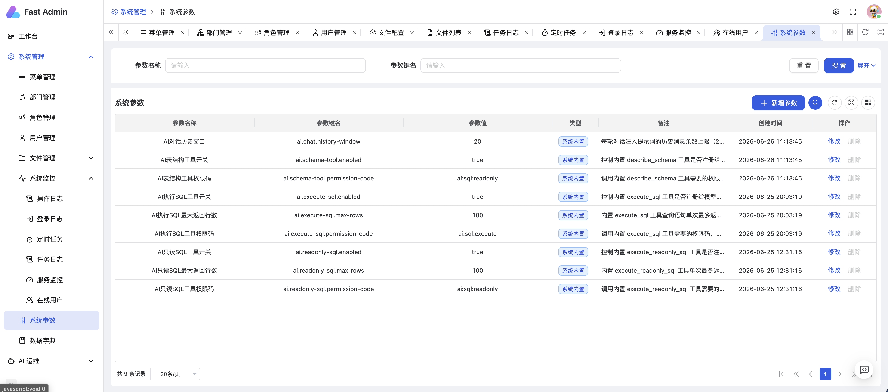
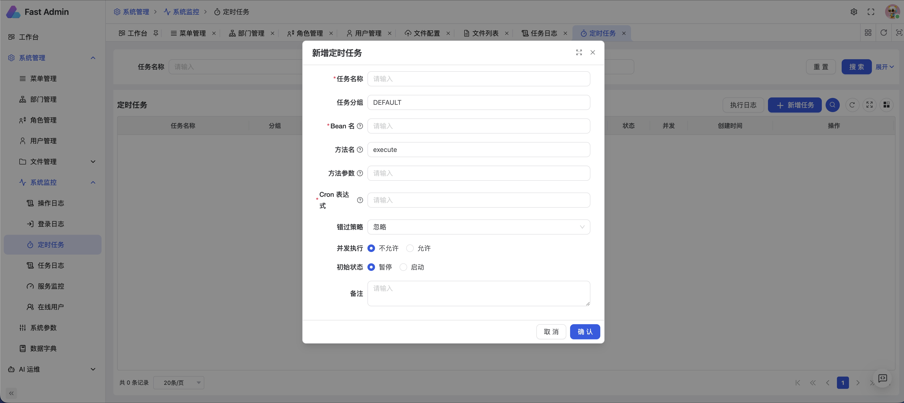
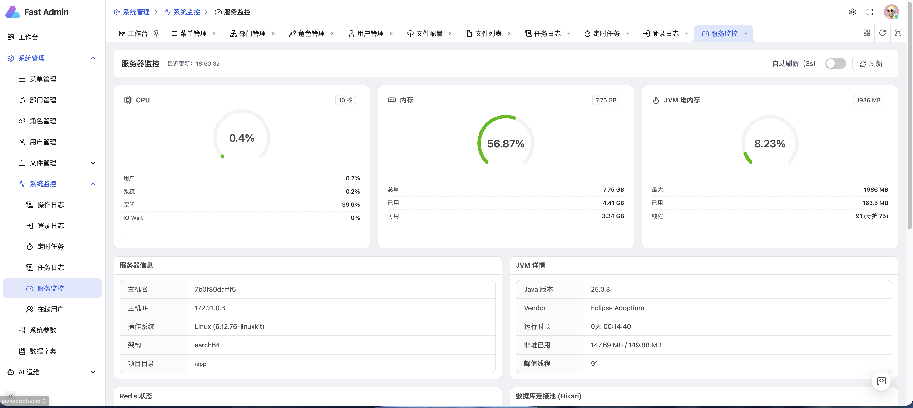
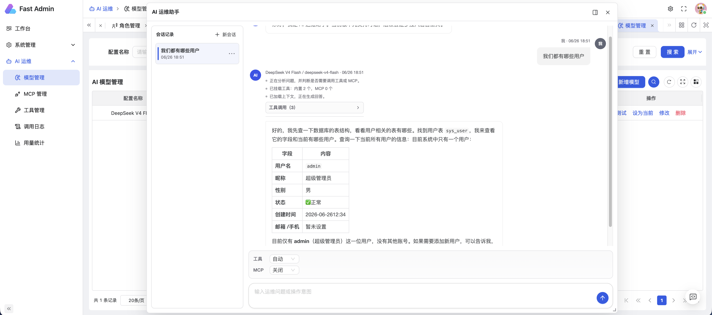

# fast-admin

> 雨轩快速开发平台。基于 Spring Boot 4 + JDK 25 的后台管理脚手架，带 AI 助手和工作流。


**演示地址：** https://fa-admin.oofo.cc

> 账号 `admin` · 密码 `admin123`

## 截图预览

|              工作台               |               用户管理                |               角色管理                |
| :-------------------------------: | :-----------------------------------: | :-----------------------------------: |
|  |  |  |

|               菜单管理                |               数据字典                |               系统参数                |
| :-----------------------------------: | :-----------------------------------: | :-----------------------------------: |
|  |  |  |

|               定时任务                |               服务监控                |                AI 运维助手                |
| :-----------------------------------: | :-----------------------------------: | :---------------------------------------: |
|  |  |  |

## 功能

- **权限与组织**：Sa-Token 登录鉴权，RBAC 角色权限，部门和数据范围控制，在线用户管理
- **系统管理**：用户、角色、菜单、部门、字典、参数、定时任务、操作与登录日志
- **工作流**：基于 Flowable 8 的流程设计器、自定义表单、发起与审批、待办 / 已办 / 抄送、流程跟踪（基础版，仍在完善，见 [待办文档](docs/FLOW_BPM_TODO.md)）
- **AI 助手**：基于 Spring AI 2.0，多模型配置切换、自定义 Tool、MCP 接入，SQL 工具带敏感字段防护
- **文件存储**：本地、阿里云 OSS、AWS S3、FTP、SFTP，运行时可切换
- **服务监控**：基于 OSHI 采集 CPU、内存、JVM、磁盘信息
- **部署**：提供 `docker-compose`，前后端分离镜像

## 技术栈

| 层次          | 选型                                                       |
| ------------- | ---------------------------------------------------------- |
| 语言 / 运行时 | JDK 25                                                     |
| Web 框架      | Spring Boot 4.1                                            |
| 鉴权          | Sa-Token                                                   |
| ORM           | MyBatis-Plus 3.5 + MyBatis-Plus-Join                       |
| 数据库        | MySQL 8.4（兼容 PostgreSQL）                               |
| 缓存          | Redis 6（Lettuce）                                         |
| AI            | Spring AI 2.0，兼容 OpenAI / Anthropic / OpenAI-Compatible |
| 工作流        | Flowable 8（BPMN 2.0）                                     |
| 定时任务      | Quartz                                                     |
| API 文档      | Knife4j（OpenAPI 3）                                       |
| Excel         | EasyExcel                                                  |
| ID 生成       | KSUID                                                      |
| 加密          | jBCrypt                                                    |
| 前端          | Vue 3 + Vben Admin 5                                       |

## 模块

| 模块                                    | 说明                                                                                            |
| --------------------------------------- | ----------------------------------------------------------------------------------------------- |
| [`fast-framework`](fast-framework/)     | 框架基础：BaseEntity / BaseService / 全局异常 / TraceId / Excel / 代码生成                      |
| [`fast-system`](fast-system/)           | 系统模块：用户、角色、部门、菜单、权限、字典、文件、定时任务、操作/登录日志、服务监控、在线用户 |
| [`fast-ai`](fast-ai/)                   | AI 模块：模型配置、对话、Tool 调用、MCP 接入、知识库（RAG 向量检索）、工具调用日志              |
| [`fast-flow`](fast-flow/)               | 工作流模块：Flowable 8 流程设计、自定义表单、发起与审批、待办与抄送、流程跟踪                   |
| [`fast-biz-simple`](fast-biz-simple/)   | 业务模块模板（复制即用，[使用说明](fast-biz-simple/README.md)）                                 |
| [`fast-application`](fast-application/) | 启动入口与配置聚合                                                                              |
| [`fast-admin-ui`](fast-admin-ui/)       | 前端工程                                                                                        |

## 快速开始

前置：JDK 25、MySQL 8+、Redis 6+、Maven 3.9+。可用 [mise](https://mise.jdx.dev) 一键安装：`mise install`。

```bash
# 1. 建库
mysql -uroot -p -e "CREATE DATABASE fast_admin DEFAULT CHARSET utf8mb4;"

# 2. 修改本地连接
#    fast-application/src/main/resources/config/application-database.yml
#    fast-application/src/main/resources/config/application-redis.yml

# 3. 启动
mvn -pl fast-application -am spring-boot:run
```

启动后：API 文档 → http://localhost:8080/doc.html

### Docker 部署

```bash
cd deploy
cp .env.example .env   # 按需修改
docker compose up -d
```

## 配置

`fast-application/src/main/resources/config/` 按职能拆分：

```
application-database.yml   数据源 + Hikari
application-redis.yml      Redis 连接
application-auth.yml       Sa-Token
application-mybatis.yml    MyBatis-Plus
application-quartz.yml     Quartz 定时任务
application-upload.yml     文件存储
application-logging.yml    日志
```

## 进度

### 已完成

- [x] Spring Boot 4 + JDK 25 工程基础
- [x] Sa-Token 登录鉴权 + RBAC 权限体系
- [x] 用户 / 角色 / 菜单 / 部门 / 字典管理
- [x] 定时任务（Quartz）+ 执行日志
- [x] 操作日志 / 登录日志
- [x] 服务监控（CPU / 内存 / JVM / 磁盘）
- [x] 文件存储多策略（本地 / OSS / S3 / FTP / SFTP）
- [x] EasyExcel 注解式导入导出
- [x] Knife4j OpenAPI 文档
- [x] Docker Compose 一键部署
- [x] AI 运营助手（Spring AI 2.0）
- [x] AI 多模型配置管理（OpenAI / Anthropic / OpenAI-Compatible）
- [x] AI 自定义 Tool（SQL 查询 / HTTP 调用）
- [x] AI MCP 服务接入
- [x] AI 工具调用日志
- [x] AI SQL 工具敏感字段防护（别名绕过拦截 + 结果层脱敏）
- [x] AI 知识库（RAG 向量检索：知识库 / 文档 / 分块、向量召回）
- [x] Demo 模式（只读演示环境）
- [x] 数据权限（5 级数据范围：全部 / 部门及子部门 / 本部门 / 自定义 / 仅本人）
- [x] 工作流基础版（Flowable 8）：流程设计器、自定义表单、发起 / 审批 / 驳回、待办 / 已办 / 我发起的 / 抄送、流程跟踪、组织架构选人

> 工作流目前是基础版，退回重提、会签、消息通知、接口级鉴权等还没做，剩余事项见 [docs/FLOW_BPM_TODO.md](docs/FLOW_BPM_TODO.md)。

### 计划中

- [ ] 代码生成器（按数据表生成 entity / mapper / service / controller 与前端 CRUD 页面）
- [ ] 工作流增强（退回重提 / 会签 / 加签 / 消息通知，详见 [待办文档](docs/FLOW_BPM_TODO.md)）
- [ ] 消息中心（站内通知 / WebSocket 推送，与工作流待办打通）
- [ ] 通知通道（邮件 / 短信 / 企业微信 / 钉钉，统一发送与模板）
- [ ] 登录安全（图形或滑块验证码、失败锁定、密码策略、二次认证）
- [ ] 接口防护（限流、防重复提交 / 幂等）
- [ ] 缓存管理（Redis 键查看与清理、缓存命中监控）
- [ ] 数据备份与导出中心（数据库备份、批量导出任务）
- [ ] 多租户支持
- [ ] OAuth2 / SSO 第三方登录
- [ ] 国际化（i18n）
- [ ] 移动端适配
